# Робота експерта з надання рецензії на силабус з ІТ-дисцпипліни
В даній інструкції описаний процес того, як експерти можуть надати свої рецензії на силабуси навчальних курсів з ІТ-напрямку в українських вишах.  
Для організації роботи з надання рецензій на силабуси використовується сайт  <a href  = "https://it-sertification.innovations.kh.ua/" target = "_blank">https://it-sertification.innovations.kh.ua/</a>. На ньому ви можете побачити силабуси, які пройшли сертифікацію, а також силабуси, які на даний момент подані на рецензію.
## Реєстрація
### Заповнення форми реєстрації
Для реєстрації на даному ресурсі необхідно перейти за посиланням: <a href = "https://it-sertification.innovations.kh.ua/wp-login.php?action=register" target = "_blank">https://it-sertification.innovations.kh.ua/wp-login.php?action=register</a>  
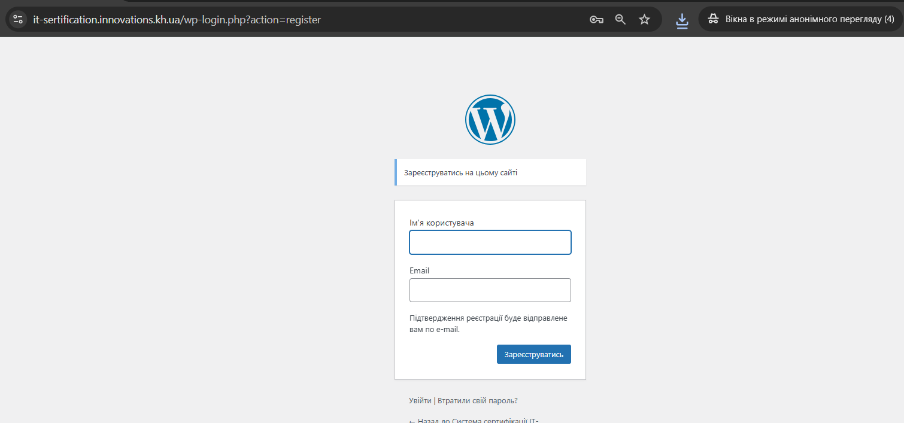  
Введіть бажаний логін, ваш email та натисніть кнопку "Зареєструватись"
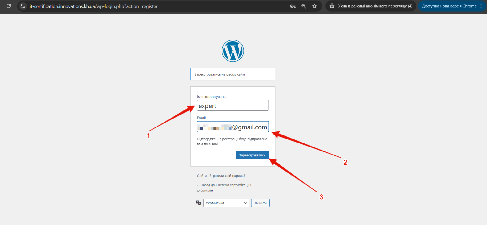  
Після натиснення кнопки "Зареєструватись" ви отримаєте повідомлення, про те, що вам необхідно перевірити власну поштову скриньку.  
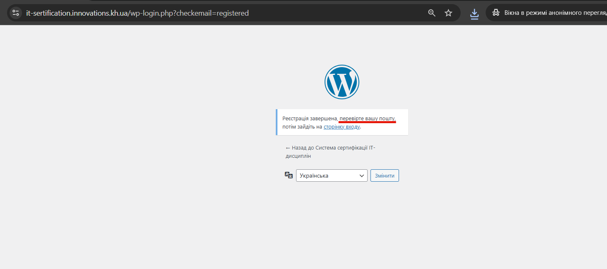  

### Поштова скринька
На вашу поштову скриньку надійде повідомлення  
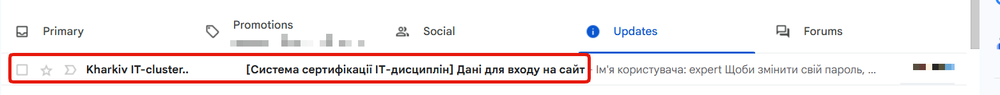  
В якому вам необхідно буде перейти за посиланням  
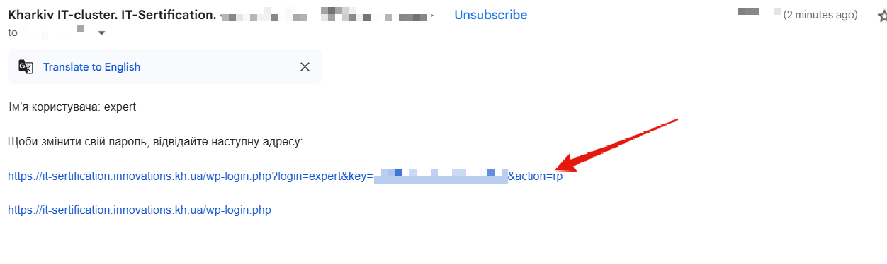  

### Встановлення паролю
Після переходу за посиланням з вашої поштової скриньки вам буде запропоновано встановити пароль вашого облікового запису.  
Ви можете скопіювати собі за зберекти автоматично згенерований пароль, або ж ввести власний. Після цього - натисніть "Зберегти пароль"  
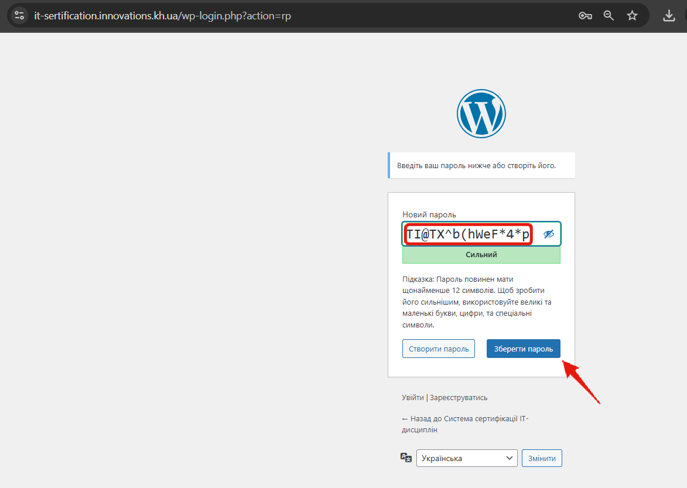  
Після збереження паролю вам буде запропонвоано увійти на сайт через відповідну форму входу.  
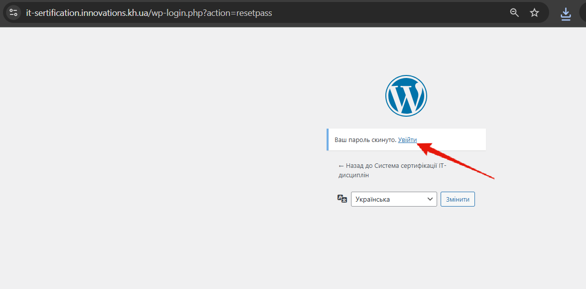  

## Вхід до облікового запису
Після реєстрації ви можете увійти до власного облікового запису за адресою <a href = "https://it-sertification.innovations.kh.ua/wp-login.php" target = "_blank">https://it-sertification.innovations.kh.ua/wp-login.php</a> за допомогою логіна та паролю, які ви вказали при реєстрації:  
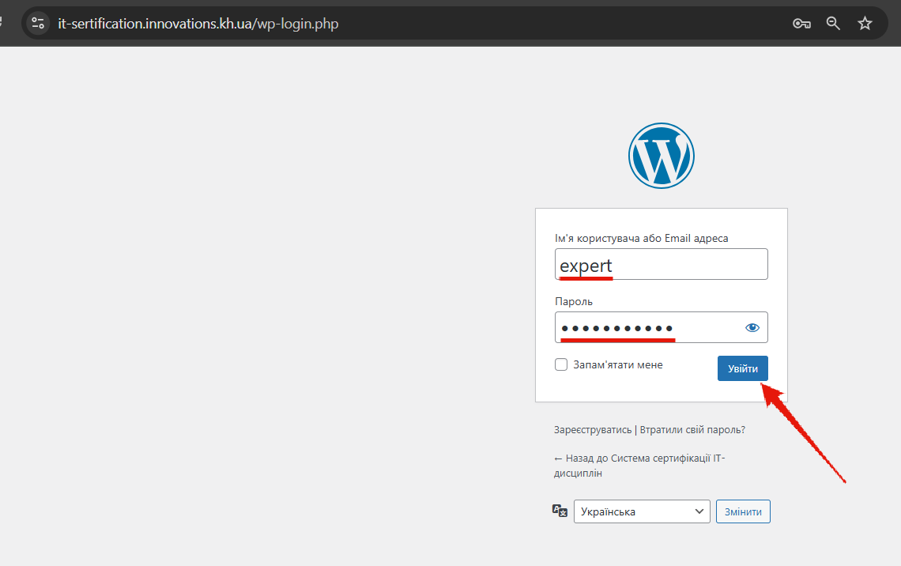  

## Відбір силабусу для рецензування
Для того, щоб зробити рецензію ви маєте обрати поданий на рецензування силабус. Зробити ви це можете на сторінці силабусів: <a href = "https://it-sertification.innovations.kh.ua/silabuses/" target = "_blank">https://it-sertification.innovations.kh.ua/silabuses/</a>. Наприклад, ви обрали силабус за курсом Web дизайн.  
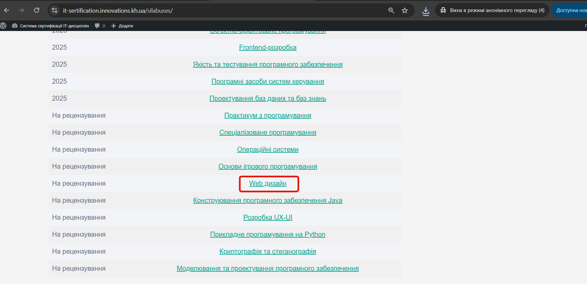  

Перейдя за посиланням ви можете побачити всю інформацію відносно силабусу, поданого на розгляд.  
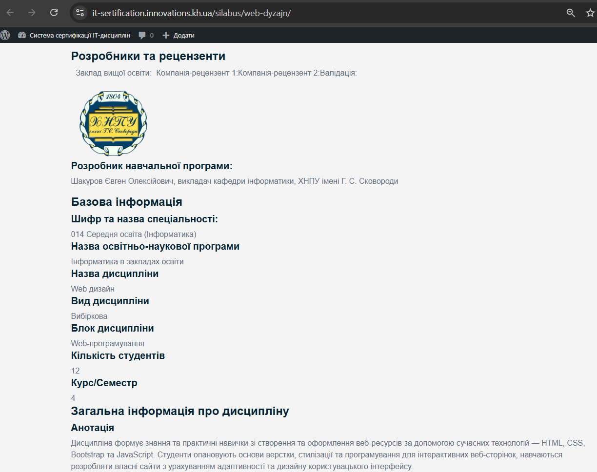  

## Робота в особистому кабінеті
При вході ви попадаєте в стандартний інтерфейс CMS WordPress. Для надання рецензії вам треба перейти до меню **Reviews**.  
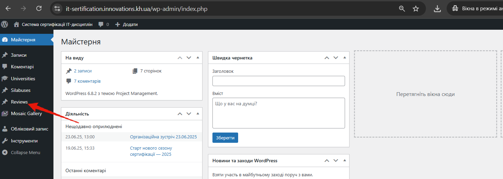  

У розділі **Reviews** необхідно натиснути кнопку **"Add new Review"**  
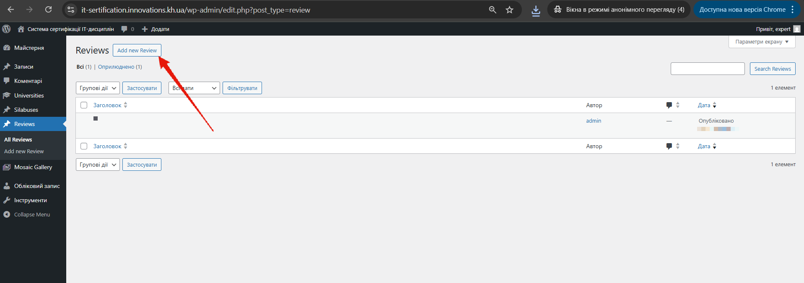  

При додаванні нової рецензії ви маєте обрати силабус. Для цього почніть вводити його назву і оберіть відповідний силабс з випадаючого перелку.  
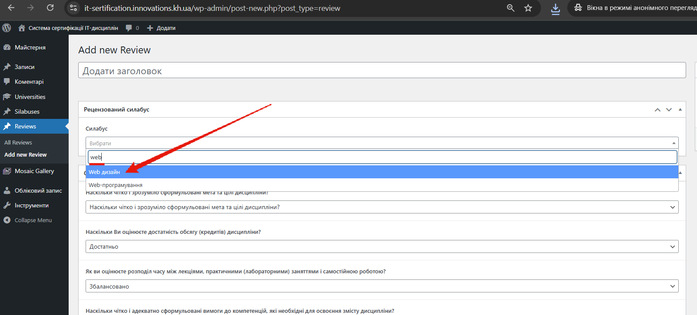  
Окрім обраного силабусу у вас є 5 блоків для надання рецензії: 1. Оцінка загальної інформації про дисципліну, 2. Оцінка структури дисципліни, 3. Оцінка джерел та критеріїв оцінки результатів навчання, 4. Загальні висновки щодо силабусу. та 5. Підпис рецензента.  Для згортання/розгортання відповідних блоків склгує трикунтик в правому кінці блоку.  
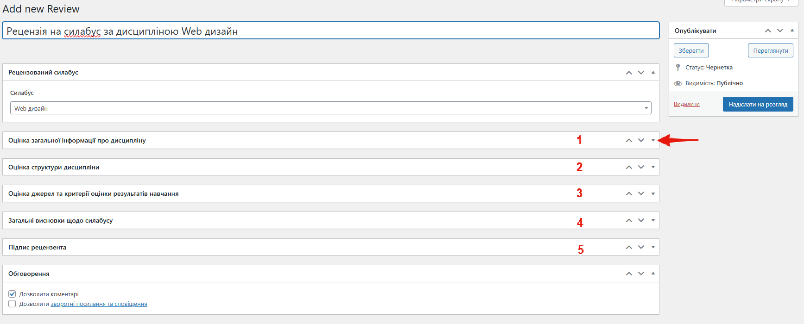  

В деяких блоках при виборі позиції, яка потребує роз'яснень, динамічно з'являється відповідне поле для введення коментарів.  
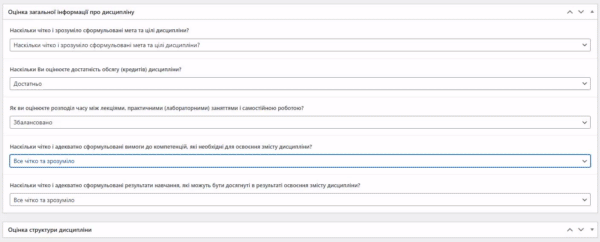  
Далі вам необхідно по черзі заповнити всі блоки рецензії:  
1. Оцінка загальної інформації про дисципліну  
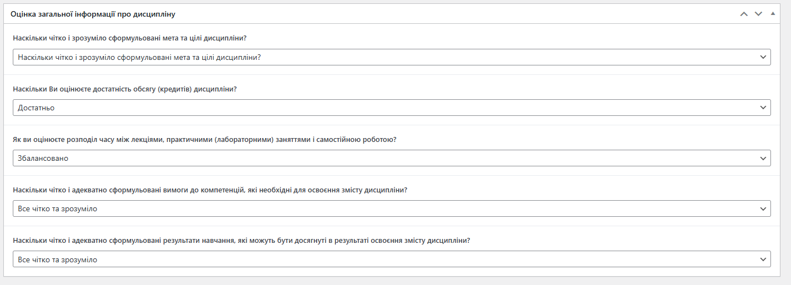  
2. Оцінка структури дисципліни  
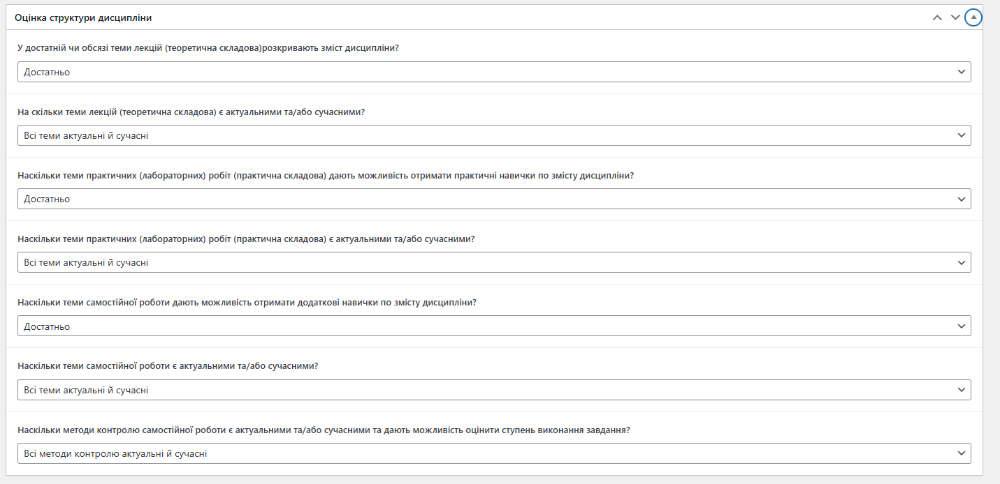  
3. Оцінка джерел та критеріїв оцінки результатів навчання
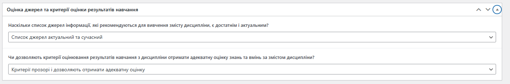  
4. Загальні висновки щодо силабусу
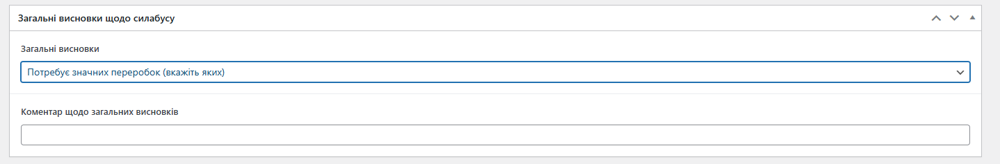  
5. Підпис рецензента
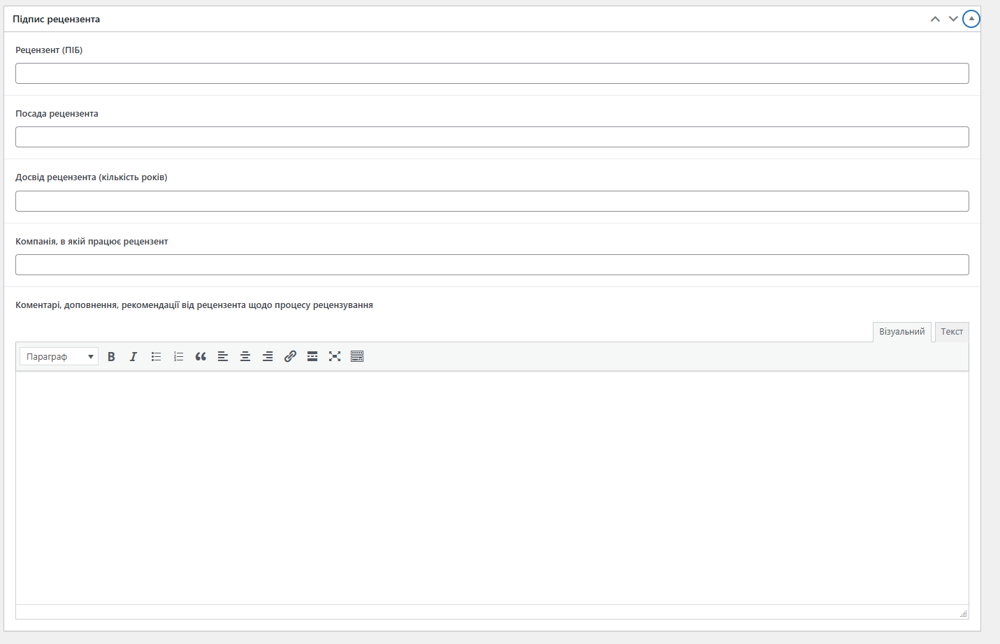  

## Надсилання на розгляд
Після заповнення всіх блоків вашу звповнену рецензію необхідно надіслати на розгляд, натиснувши відповідну кнопку  
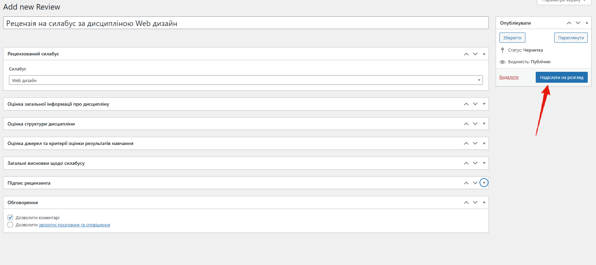  
Після відправки ви на розгляд ви отримаєте відповідне повідомлення  
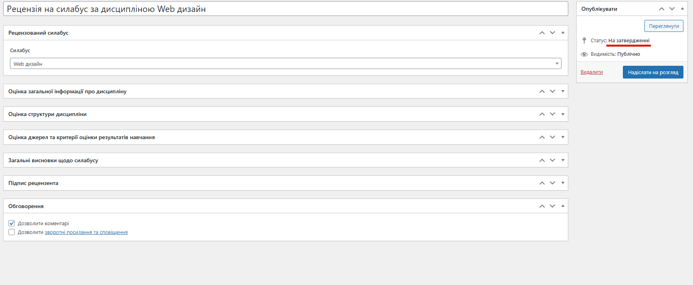  

## Дякуємо за співпрацю!
